# Security Assessment, Analysis and Recommendations to Harden Vulnerable System 

## Contents
### 1. Summary
### 2. Network Topology
   - Network Diagram
   - Network Red Team vs Blue Team Subnet
### 3. Red Team Security Assessment
   #### Recon
  - Hosts on Network
   #### Vulnerability Assessment
  - Improper Authorisation of Index Containing Sensitive Information
  - Exposure of Sensitive Information to an Unauthorised Actor
  - Inadequate Encryption Strength
  - Weak Password Requirements
  - Insecure Storage of Sensitive Information 
  - Unrestricted Upload of File
  - Weak Encoding for Password
   #### Exploitation 
  - NMAP Scan
  - Sensitive Data Exposure
  - Brute Force Attack
  - Unlock Folder to Compromise Server
  - Password Crack 
  - Upload PHP to WebDav
  - Remote Code Execution
### 4. Blue Team Log Analysis and Attack Characterisation
  - Identifying the Port Scan 
  - Finding the Request for the Hidden Directory 
  - Uncovering the Brute Force Attack
  - Identify WebDav Connection and Reverse Shell
### 5. Blue Team Proposed Alarms and Mitigation Strategies
  - Finding the Request for the Hidden Directory 
  - Preventing Brute Force Attacks 
  - Detecting the WebDav Connection
  - Identifying Reverse Shell Uploads

## Summary
This document contains a summary of the critical security flaws discovered in the Red Team Security Assessment of Project 2 Red-vs-Blue Team.

The vulnerabilities were identified on the network using penetration testing tools and manual security analysis techniques. The Common Weakness Enumeration (CWE) is an industry-standard classification of types of software weaknesses or flaws, that can lead to security problems. CWE™ is a community-developed list of software and hardware weakness types. It serves as a common language, a measuring stick for security tools, and as a baseline for weakness identification, mitigation, and prevention efforts.

In the Blue Team Log Analysis and Attack Characterisation we utilise Kibana in Elastic Stack to analyse and illustrate the attack. Kibana enables the visual analysis of data from an Elasticsearch with Logstash and Beats. Using Kibana’s interface allows us to query data in Elasticsearch indices and then visualise the results through various chart options.

The Blue Team proposes mitigation strategies to create alarms and harden the system concerning the flaws discovered.  The recommendations are not exhaustive.

## Network Topology
Below is the network topology of the project, inclusive of the Kali attacking machine, the ELK server, and the victim server

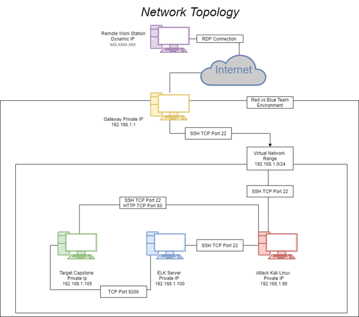

#### Network Red Team vs Blue Team Subnet

| IP Address Range | Subnet Netmask | Gateway 
|------------------|---------|---------
 192.168.1.0/24 |  255.255.255.0 | 192.168.1.1

## Red Team Security Assessment

### Recon
#### We used NMAP to scan the network, and identified the following hosts

Hostname | IP Address | Role on Network
---------|------------|----------------
Gateway | 192.168.1.1 | Hyper-V Host
Kali Linux | 192.168.1.90 | Attack (Penetration Tester) Machine 
ELK Server | 192.168.1.100 | Security Monitoring 
Capstone | 192.168.1.105 | Target (Vulnerable Web) Server

### Vulnerability Assessment 

#### Improper Authorisation of Index Containing Sensitive Information
Vulnerability | Description | Impact
--------------|-------------|-------
[CWE-612](https://cwe.mitre.org/data/definitions/612.html) | The product creates a search index of private or sensitive documents, but it does not properly limit index access to actors who are authorised to see the original information | Web sites and other document repositories may apply an indexing routine against a group of private documents to facilitate search. If the index’s results are available to parties who do not have access to the documents being indexed, then attackers could obtain portions of the documents by conducting targeted searches and reading the results. The risk is especially dangerous if search results include surrounding text that was not part of the search query. This issue can appear in search engines that are not configured (or implemented) to ignore critical files that should remain hidden; even without permissions to download these files directly, the remote user could read them

####  Exposure of Sensitive Information to an Unauthorised Actor
Vulnerability | Description | Impact
--------------|-------------|-------
[CWE-200](https://cwe.mitre.org/data/definitions/200.html) | The product exposes sensitive information to an actor that is not explicitly authorised to have access to that information | There are many different kinds of mistakes that introduce information exposures. The severity of the error can range widely, depending on the context in which the product operates, the type of sensitive information that is revealed, and the benefits it may provide to an attacker. Some kinds of sensitive information include: private, personal information, such as personal messages, financial data, health records, geographic location, or contact details

#### Inadequate Encryption Strength
Vulnerability | Description | Impact
--------------|-------------|-------
[CWE-326](https://cwe.mitre.org/data/definitions/326.html) | A weak encryption scheme can be subjected to brute force attacks that have a reasonable chance of succeeding using current attack methods and resources | An attacker may be able to decrypt the data using brute force attacks

#### Weak Password Requirements
Vulnerability | Description | Impact
--------------|-------------|-------
[CWE-521](https://cwe.mitre.org/data/definitions/521.html) | The product does not require that users should have strong passwords, which makes it easier for attackers to compromise user accounts | An attacker could easily guess user passwords and gain access user accounts

#### Insecure Storage of Sensitive Information
Vulnerability | Description | Impact
--------------|-------------|-------
[CWE-922](https://cwe.mitre.org/data/definitions/922.html) | If read access is not properly restricted, then attackers can steal sensitive information. If write access is not properly restricted, then attackers can modify and possibly delete the data, causing incorrect results and possibly a denial of service | Attackers can read sensitive information by accessing the unrestricted storage mechanism

#### Unrestricted Upload of File
Vulnerability | Description | Impact
--------------|-------------|-------
[CWE-434](https://cwe.mitre.org/data/definitions/434.html) |The software allows the attacker to upload or transfer files of dangerous types that can be automatically processed within the product’s environment | Arbitrary code execution is possible if an uploaded file is interpreted and executed as code by the recipient. This is especially true for .asp and .php extensions uploaded to web servers because these file types are often treated as automatically executable, even when file system permissions do not specify execution. For example, in Unix environments, programs typically cannot run unless the execute bit is set, but PHP programs may be executed by the web server without directly invoking them on the operating system

#### Weak Encoding for Password
Vulnerability | Description | Impact
--------------|-------------|-------
[CWE-261](https://cwe.mitre.org/data/definitions/261.html) | Obscuring a password with a trivial encoding does not protect the password | Gain Privileges or Assume Identity

### Exploitation 

#### NMAP Scan - Improper Authorisation of Index Containing Sensitive Information
Tools | Processes | Achievements 
------|-----------|-------------
[NMAP](https://nmap.org/) | We start with a port scan to enumerate the network command: `nmap 192.168.1.0/24` We enumerate further with NMAP to find services and versions running command: `nmap -sV -A 192.168.1.105` | Identify IP address 192.168.1.105, TCP Ports 22 and 80 open, We also uncover Apache version and Web Directory Index 

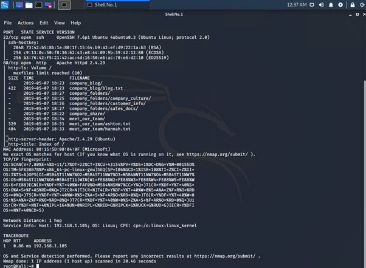

#### Sensitive Data Exposure - Exposure of Sensitive Information to an Unauthorised Actor
Tools | Processes | Achievements
------|-----------|-------------
Open HTTP Port 80 | We access the insecure Apache HTTP website 192.168.1.105 | Navigating through the directories we find information relating to the company_secret_folder

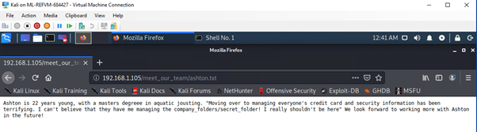

#### Brute Force Attack - Inadequate Encryption Strength
Tools | Processes | Achievements
------|-----------|-------------
[Hydra](https://tools.kali.org/password-attacks/hydra) | We use the information found in the company_secret_folder and run a brute-force attack on the password protected secret folder command: `hydra -l ashton -P /usr/share/wordlists/rockyou.txt -s 80 -f -vV 192.168.1.105 http-get /company_folders/secret_folder` | Successful retrieval of User and Password 

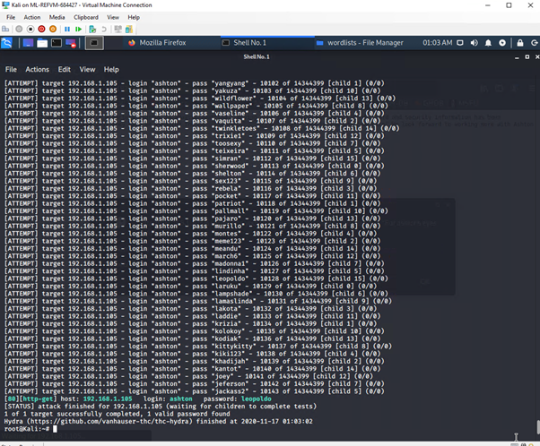
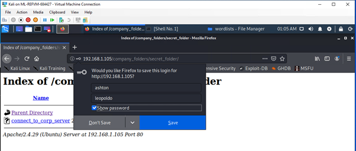

#### Unlock Folder to Compromise Server - Insecure Storage of Sensitive Information
Tools | Processes | Achievements
------|-----------|-------------
Manual access via folder | Access password-protected folder with credentials obtained, Analyse contents | Uncover instructions to access the WebDav Corporate Server and user Ryans Hash

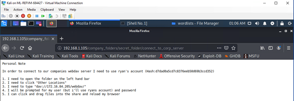

#### Password Crack - Weak Encoding for Password
Tools | Processes | Achievements
------|-----------|-------------
[Crackstation](https://crackstation.net/) | Copy retrieved hash into CrackStation | Successfully obtained user Ryans Hash to login into Corporate Server 

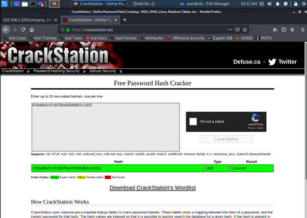

#### Upload PHP to WebDav - Unrestricted Upload of File
Tools | Processes | Achievements
------|-----------|-------------
[Cadaver](http://www.webdav.org/cadaver/) |  We use cavader the CLI for webdav to login| Successful login with user Ryans credentials, Upload of PHP file

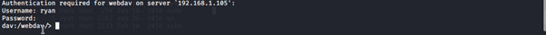
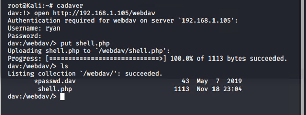
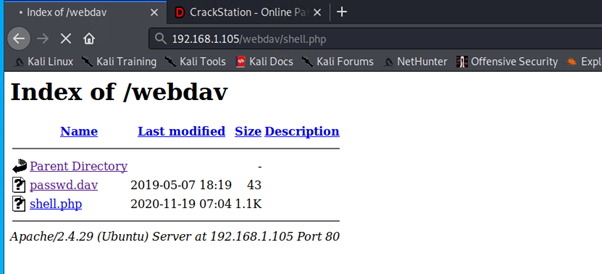

#### Remote Code Execution
Tools | Processes | Achievements
------|-----------|-------------
Msfvenom | Command-line instance of Metasploit we use to generate and output the shellcode |  Locate and customise the reverse shell script to upload 
Metasploit | Start listener and deliver payload | Performed successful reverse attack and gained shell and root access
Command Line | Command: `find . -iname flag.txt` | Search and retrieve the Flag

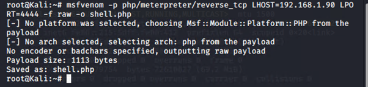

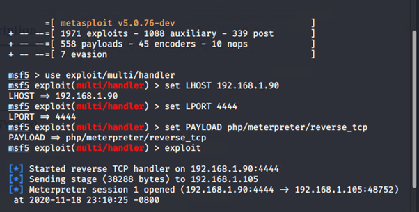

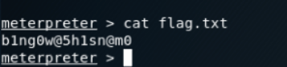

## Blue Team Log Analysis and Attack Characterisation

### Identifying the Port Scan 

*Port Scan occurred Nov 15*

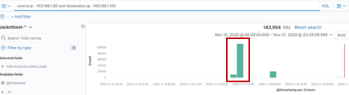

*143,984 Packets sent from the IP address 192.168.1.90* 

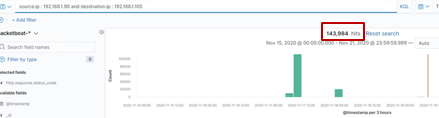

### Identifying the Port Scan

*401 Victim Responses* 

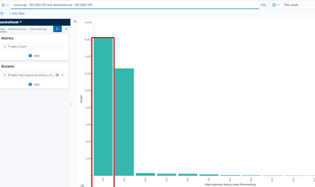

*NMAP Observed*

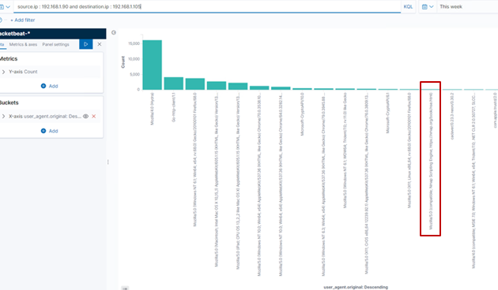

### Finding the Request for the Hidden Directory

*The requests for the Hidden Directory occurred Nov 15, 15 354 requests were made*

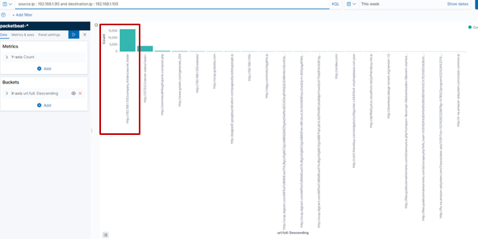

*Company Folders Secret Folder was requested*

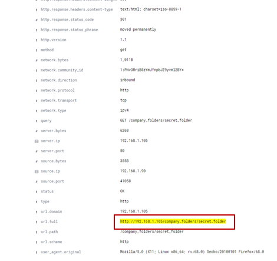

### Uncovering the Brute Force Attack

*15,451 requests were made in the attack before the password was discovered*

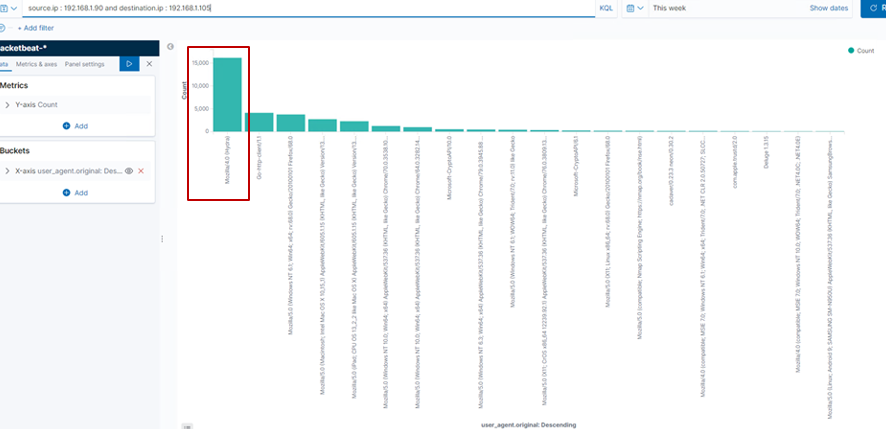

### Finding the WebDav Connection and Identify the Reverse Shell

*We see the WebDav connection and the PUT request to upload the payload to target*

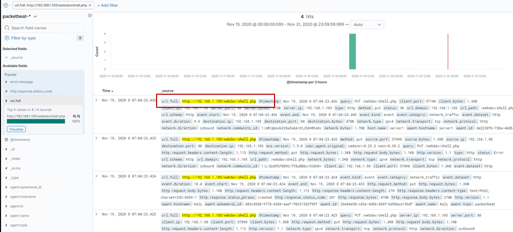

### Identify the Reverse Shell and Meterpreter Traffic

*We filter and analyse Ports and see the reverse shell*

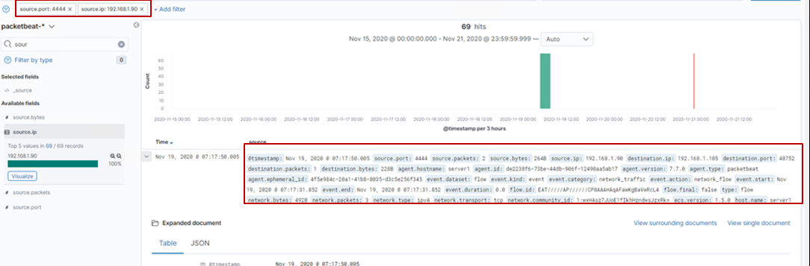

## Blue Team Proposed Alarms and Mitigation Strategies

### Identify Port Scanning
#### Alarm and System Hardening  
   - Detect NMAP 
   - Firewall Rules to detect / Block
   - Filtered Ports
   - Closed Ports
   - Rate-limiting traffic from a specific IP address would reduce the web server’s susceptibility to DoS conditions, as well as provide a hook against which to trigger alerts        against suspiciously fast series of requests that may be indicative of scanning
   
 
### Finding the Request for the Hidden Directory
#### Alarm and System Hardening
   - Monitor and Set Alarm for unauthorised access
   - Whitelist IP addresses for sensitive folder access to hidden directory
   - Multi-Factor Authentication
   - Data Encryption

### Preventing Brute Force Attacks
#### Alarm and System Hardening
   - In this case, alert to detect Hydra, however a blanket alert for multiple unsuccessful attempts
   - Block user agent (Hydra)
   - Use Certificates
   - The fail2ban utility can be enabled to protect against brute force attacks

### Detecting the WebDav Connection
#### Alarm and System Hardening
   - Alert for any IP not whitelisted accessing WebDav
   - Ban PHP extension or any files that contains executable code
   - File uploads require authentication

### Identifying Reverse Shell Uploads
#### Alarm and System Hardening
   - Alert for any outbound traffic that is not using HTTP or HTTPS protocols
   - Firewall (Stateful) to track network connections and packets
   - Ban PHP extension
   - Block Ports 4444

